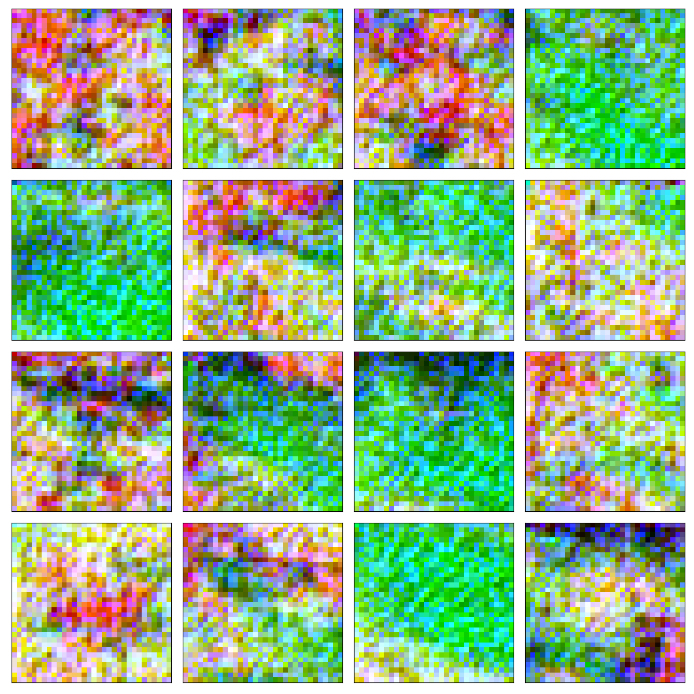

## PixelCNN implementation based on the original van der Oord paper

* the network output is actually a mixture of logistics following the PixelCNN++ paper by Salimans et al.
* I took the code for loss computation from the OpenAI pixelcnn_pp repository for stable loss computation but I implemented it myself as well
	* for reasons of stability the OpenAI loss provides better samples

* here's a sample from a network trained with the OpenAI loss on the CIFAR-10 dataset:

